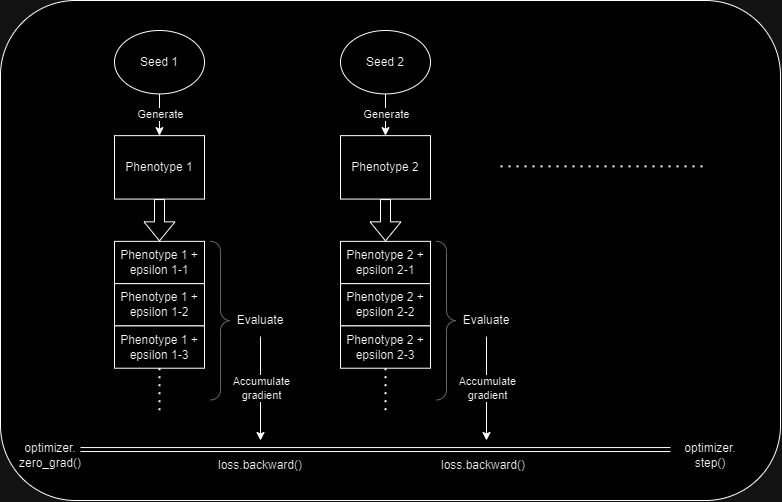
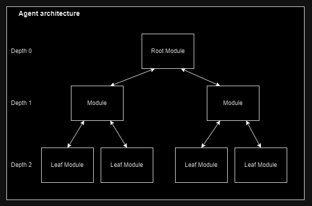

# Deep Modular Continuous Evolution

A 2 loops meta-learning black box algorithm. Is best suited for tasks requiring memory and in-environment learning. Instances of the problem to be solved will be refered to as *trials*. Trials need not return rewards at each step, but only a *score* at the end.

This algorithm is currently being tested on quadruped motor control with sensorymotor information (petoi bittle and unitree go1), as well as on the video game Rocket League.

The agent's architecture is very similar to that in the [MoEv](https://github.com/Yeb02/CUDA_MoEv) algorithm. 

## The meta-learning algorithm

### Principles

A genetic algorithm (GA) that evolves agents with a common topology maintains a population of genomes, vectors of $\mathbb{R}^n$. As the size of the population grows towards infinity, the genomes can be seen as samples from a probability distribution over $\mathbb{R}^n$. 

DeMoCEvo builds on this view, maintaining and updating a continuous probability distribution over genomes instead of a discrete population. The distribution is modeled with hyper-networks, i.e. network-generating networks. There are 2 algorithms implemented to meta-learn the hyper-networks weights: the first one is inspired by the [Evolution Strategy](https://arxiv.org/pdf/1703.03864.pdf) (ES) algorithm, and will be the one used in the detailed explanations down below. The other is based on monte-carlo tree search, and is still experimental.

The main advantage of DeMoCEvo over a traditional GA is the ability to share meta-learning (within the population/distribution) semantically through the hyper-networks weight updates, instead of through handcrafted, non-semantic, crossover operations. 
 
 
**Potential flaw:** The "diversity" in a discrete population setting is the same notion as the entropy of the hyper-network's output distribution here. It is essential to maintain diversity in the traditional GA, so as to broaden the search space. It is as important for DeMoCEvo, as its aforementionned strength relies on the diversity of the generated networks. Therefore a collapse of the hyper-networks on only one genotype would greatly reduce the algorithm's effectiveness. It has not happened at all as of now, but only small problem sizes have been tested. Methods to prevent it are still to be designed.
 
 
#### Teachers
Similar to [MoEv](https://github.com/Yeb02/CUDA_MoEv), a discrete population of agents called teachers is maintained.  
*Information* extracted from the environment over the course of evolution is embodied implicitly in 2 containers, 2 "memory"s whose characteristics are complementary.
 
- The first one, classicaly, is the population's genomes, or in this case the hyper-networks parameters. It resides outside of the environment, and can be seen as atavic knowledge, or meta-knowledge.  

- The second one is accumulated by each agent in its weights, and comes from its experiences during its lifetime. In a classical genetic algorithm, it would be discarded at the end of the agent's evaluation, as only the fitness (1 real number !) is used. Evolution obviously learns slowly in this setting, the information bottleneck being 1 number wide.
 
DeMoCEvo attempts to transmit lifetime knowledge in order to increase the information flow throughout evolution. At each step, a discrete population of agents from anterior steps, called teachers, are used to transfer the in-environment knowledge they have gathered. To this end, the new agents are supervised by teachers during the first part of their lifetime; they learn by imitation.   Besides throughput, in-environment information has many advantages over genomic information, the most proeminent being speed: it would be much faster to update, were it incorrect or had the environment changed.

### Pseudo code

Evolution is a sequence of evolution steps, an evolution step consists in the following substeps:

- Zero the gradients of the hyper-networks.
- $n_s$ times:
  - Sample a "seed" from a gaussian distribution of dimension $s_s$. Feed the seed to the hyper-networks to generate a genotype.
  - $n_p$ times:
    - Generate a random gaussian perturbation of the genotype. This perturbed genotype is used to create the phenotype of the effective agent $\mathbb{A}$.
    - $\mathbb{A}$ experiences $n_{supervised}$ trials, during which its actions are supervised by teachers (one teacher per trial). 
    - Then $\mathbb{A}$ experiences $n_{evaluated}$ trials, the scores returned by the trials are accumulated to compute $\mathbb{A}$'s fitness.
  - In ES fashion, the *label* associated with the seed, or *target* of the hyper-networks is the barycenter of the perturbed genotypes weighted by their fitnesses. It is used to compute the loss of the hyper-networks, and the gradients are accumulated.
- Perform a step of the optimizer, updating the weights of the hyper-networks. 

In the practical implementation, many tweaks of the algorithm are needed for convergence. The two most important are: 

- mirroring each perturbation, i.e. also evaluating its opposite as ES recommends. Let $\mathbb{G}$ the unperturbed genome, $\epsilon$ a gaussian perturbation vector. Both the agent constructed from $\mathbb{G} + \epsilon$ and $\mathbb{G} - \epsilon$ must be evaluated.
 
- evaluating the unperturbed genome $\mathbb{G}$, to give a reference fitness when computing the barycenter's weights magnitude. Let $\mathbb{A}$ the agent constructed from $\mathbb{G}$, $\mathbb{A}^{+\epsilon}$ the agent constructed from $\mathbb{G} + \epsilon$, $\mathbb{A}^{-\epsilon}$ the agent constructed from $\mathbb{G} - \epsilon$, and $f(-)$ the fitness of an agent.  
  If both $f(\mathbb{A}^{-\epsilon})$ and $f(\mathbb{A}^{+\epsilon})$ are better than $f(\mathbb{A})$, a change of the genome in either direction is desirable, and the weight of $\epsilon$ in the *target* has a great magnitude. At the opposite, if both $f(\mathbb{A}^{-\epsilon})$ and $f(\mathbb{A}^{+\epsilon})$ are worse than $f(\mathbb{A})$, a change of the genome in either direction is not advisable, and the weight of $\epsilon$ in the *target* has a small magnitude.
  

## Agent architecture

The agent's network architecture is a tree of *modules*. A module has an input activation vector, an output activation vector, and a set of children phenotypic modules. At a certain depth of the tree, all modules have the same size hyperparameters. Those are input size, output size, and number of children. Therefore they only differ by the values of their parameters, by their and children.

The activations and weights are modified as instructed by predictive coding principles. The additional concept of modulation is introduced, to hopefully allow the emergence of an "internal" learning paradigm, like in animal brains. This is the part of the algorithm that still needs a lot of work, the following solution is temporary.   Currently, it is implemented by computing a learning rate $\alpha$ for each activation $x$, that modulates the update of all weights leading to $x$. $\alpha$ is computed at each learning step by multiplying the activations predicting $x$ with a fixed, meta-learned matrix.  

The agent has a pointer to the root module, and an inference / learning step is performed by calling the appropriate recursive function on the root. The agent's observation and action are the input and output of the root (not necessarily, as with PC both observations and actions can be either input or output).  

## Implementation notes and longer term TODOs

CUDA and Cublas functions will be merged to the main branch when a satisfactory modulation rule for predictive coding is found. The time it takes to develop and iterate on kernels is not worth the performance gain on my hardware (GTX 1050M). In the mean time, acceleration relies on libtorch's CPU and GPU BLAS.  

There are 2 major hindrances to predictive coding's efficiency: 
- low GPU occupancy as its operations are matrix-vector products, memory bound.
- each "time step" in the simulation requires a number of inference steps, and the deeper the network the worst it gets. 5 layers require at least 16 steps.

We could kill two birds with one stone by grouping the activations of (32 ? 128 ? ...) adjacent time steps into a matrix, and performing inference simultaneously on those. Modulation (i.e. learning, theta update) would only apply to the last column at each time step, that is the activations inferred from the oldest observation, on which the inference process has had time to converge. The idea is similar but not identical to iPC. And the agent's action would also be the converged activations of the last column. However this would induce latency, but I have an idea that could alleviate it 

Looking further, this algorithm would greatly benefit from being entirely ported to GPU, using something like [Isaac gym](https://developer.nvidia.com/isaac-gym) for the trials. 

There are many hyperparameters to play with, and variants of the algorithm to switch to. These can be tweaked in main.cpp and config.h .

