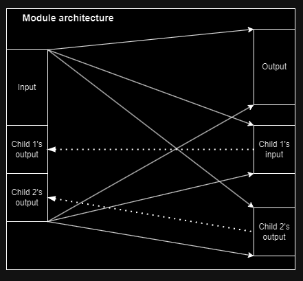

# Deep Modular Continuous Evolution

A 2 loops meta-learning black box algorithm. Is best suited for tasks requiring memory and in-environment learning. Instances of the problem to be solved will be refered to as *trials*. Trials need not return rewards at each step, but only a *score* at the end.

This algorithm is currently being tested on quadruped motor control with sensorymotor information (petoi bittle and unitree go1), as well as on the video game Rocket League.

The agent's architecture is very similar to that in the [MoEv](https://github.com/Yeb02/CUDA_MoEv) algorithm. 

## The meta-learning algorithm

A genetic algorithm that evolves agents with the same architecture maintains a population of genomes, vectors of $\mathbb{R}^n$. As the size of the population grows towards infinity, the genomes can be seen as samples from a probability distribution over $\mathbb{R}^n$. 

DeMoCEvo implements this idea, maintaining and updating a continuous probability distribution over genomes instead of a discrete population. The distribution is modeled with hyper-networks, i.e. network-generating networks, using libtorch for deep learning. Meta-learning is inspired by the [Evolution Strategy](https://arxiv.org/pdf/1703.03864.pdf) algorithm. Evolution is a sequence of evolution steps, an evolution step consists in the following substeps:

- Zero the gradients of the hyper-networks.
- $n_s$ times:
  - Sample a seed from a gaussian distribution of size $s_s$ ($s_s$ small). Generate a genotype from the seed with the hyper-networks.
  - $n_p$ times:
    - Generate a random gaussian perturbation of the genotype. This genotype is used to create the phenotype of the effective agent $\mathbb{A}$.
    - $\mathbb{A}$ experiences $n_supervised$ trials, during which its actions are supervised by a teacher agent. Teachers are agents that performed the best until now (over the whole evolution process).
    - Then $\mathbb{A}$ experiences $n_evaluated$ trials, the scores returned by the trials are accumulated to compute $\mathbb{A}$'s fitness.
  - In ES fashion, the *label*, or *target* of the hyper-networks is the barycenter of the perturbated genotypes weighted by their fitnesses. It is then used to compute the loss of the hyper-networks, and          the gradients are accumulated
- Perform a step of the optimizer, updating the weights of the hyper-networks. 

  In the practical implementations, many tweaks are needed for convergence. The two most important are: mirroring each perturbation, i.e. also evaluating its opposite; and evaluating the unperturbated genome, to give a reference fitness when computing the barycenter weights magnitude.
  

## Agent architecture

The agent's network architecture is a tree of *modules*. A module has an input activation vector, an output activation vector, and a set of children phenotypic modules. At a certain depth of the tree, all modules have the same size hyperparameters. Those are input size, output size, and number of children. Therefore they only differ by the values of their parameters, by their and children.

The agent has a pointer to the root module, and an inference / learning step is performed by calling the appropriate recursive function on the root. The agent's observation and action are the input and output of the root (not necessarily, as with PC both observations and actions can be either input or output)/sup>.  

